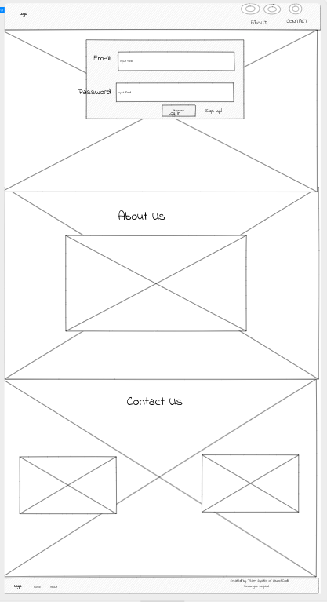
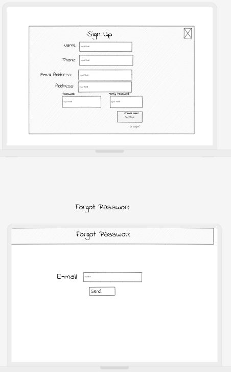
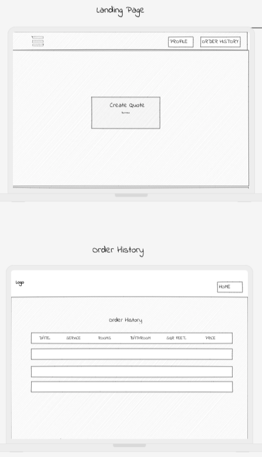

# Project Planning
For this assignment, you'll create some initial plans for your project.

## Assignment Description
[Project Planning Assignment](https://education.launchcode.org/liftoff/modules/assignments/project-planning)

## Submission Instructions

### Wireframes

Collaborative [wireframe site](https://app.uizard.io/prototypes/PjWwK68v4asnvmYZ8pGg).

My general plan [JPEG thing](https://docs.google.com/document/d/1x_nOkczwqeeU3kRIj4sx_Cl8MLcKNTmTc0RkjAOs0Uk/edit).

### Wireframe Images

### Project Tracker

[Trello Board](https://trello.com/b/69tSr3fF/qleanquotes)

### Project Repo Link

[GitHub Team Repo](https://github.com/Apr-23-LC-LiftOff-STL/Liftoff-Team-Christine)
